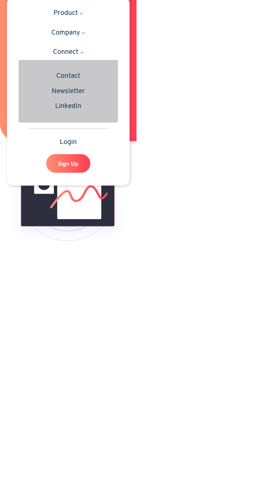

# Frontend Mentor - Blogr landing page solution

This is a solution to the [Blogr landing page challenge on Frontend Mentor](https://www.frontendmentor.io/challenges/blogr-landing-page-EX2RLAApP). Frontend Mentor challenges help you improve your coding skills by building realistic projects. 

## Table of contents

- [Overview](#overview)
  - [The challenge](#the-challenge)
  - [Screenshot](#screenshot)
  - [Links](#links)
- [My process](#my-process)
  - [Built with](#built-with)
  - [What I learned](#what-i-learned)
- [Author](#author)

## Overview
A simple HTML,CSS & some JS website or landing page to be specific

### The challenge

Users should be able to:

- View the optimal layout for the site depending on their device's screen size
- See hover states for all interactive elements on the page

### Screenshot

### Links

- Live Site URL: [live site URL](https://clupai8o0.github.io/Blogr/)

## My process
Originally I started with making the complete website in desktop view without giving a second thought
to making it more responsive and I suffered for it
The best way to do it would've been to
- Make a basic HTML containers
- Work on one element at a time making it responsive at that moment itself rather then leavin it for later
- Keep repeating this until I made it to the final
- Add js for some functionality and done

### Built with

- Semantic HTML5 markup
- CSS custom properties
- Flexbox
- CSS Grid
- Mobile-first workflow
- [Styled Components](https://tachyons.io/) - For styles

### What I learned

- Make custom CSS for speed and efficiency
- Make it responsive right away

## Author

- Frontend Mentor - [@yourusername](https://www.frontendmentor.io/profile/Clupai8o0)
